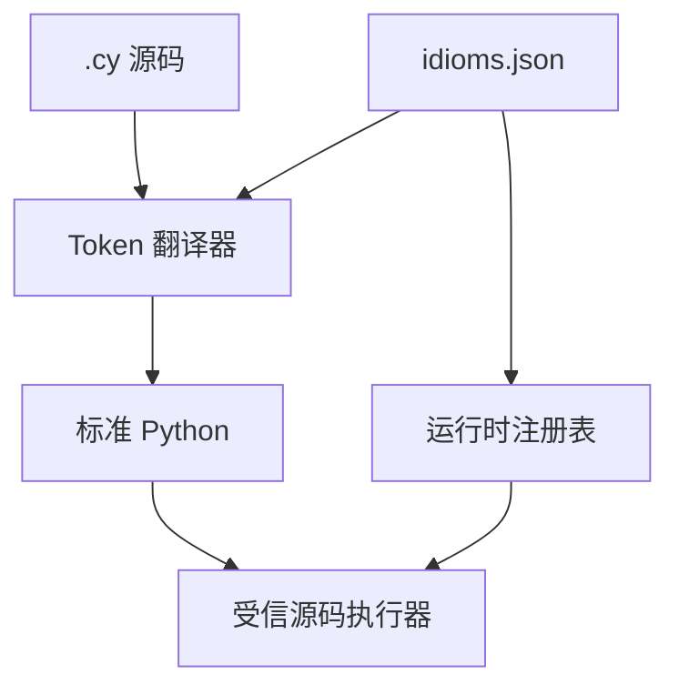

# ChengyuLang 设计说明

## 目标

项目保留“连写是正常语义、分词是彩蛋语义”的核心脑洞，同时保证词库容易扩展、
翻译结果可读，并避免把带副作用的字符串直接送入 `exec()`。

## 翻译阶段

1. 扫描单字 `NAME` Token 序列，把 `色 令 智 昏` 变成彩蛋调用；
2. 扫描后接左括号的连写成语，把名称变成运行时表索引；
3. 翻译 `之于 / 若 / 如是 / 否则 / 列 / 云云`；
4. 使用 Python `compile()` 做最终句法验证；
5. 在显式运行时注册表和调用者命名空间中执行。

彩蛋必须先处理，否则分开的四个单字可能在后续阶段失去原始边界。

## 为什么不用纯正则

纯 `re.sub` 很难同时正确处理嵌套括号、字符串、转义符和注释。Python 的
`tokenize` 即使面对尚未成为合法 Python 语法的 `色 令 智 昏`，仍能给出可靠的
Token 位置。因此翻译器只做位置替换，不手写括号解析器。

## JSON 与 Python 的职责

JSON 词条保存：

- `category`：类别；
- `py`：面向读者的正常语义说明；
- `egg`：彩蛋说明；
- `runtime`：已注册实现的名称；
- `safety`：可选安全策略。

JSON 本身不执行代码。`runtime.py` 通过装饰器维护名称到 callable 的显式映射。
这样既能只改 JSON 添加别名，也不会把 JSON 中的任意字符串变成代码执行入口。

## 明确不做的事

- 不声称提供 Python 沙箱；
- 不直接执行 `py` 或 `egg` 字段；
- 不让内置成语删除文件、终止进程或自动部署；
- MVP 不实现完整中文自然语言分词或任意文言句式。

## 后续方向

- Python AST 后处理与更准确的源位置映射；
- 交互式 REPL 和多行块编辑；
- VS Code 语法高亮、格式化与 LSP；
- 可签名的第三方词库和插件发现；
- 更完整的错误信息中文化。

